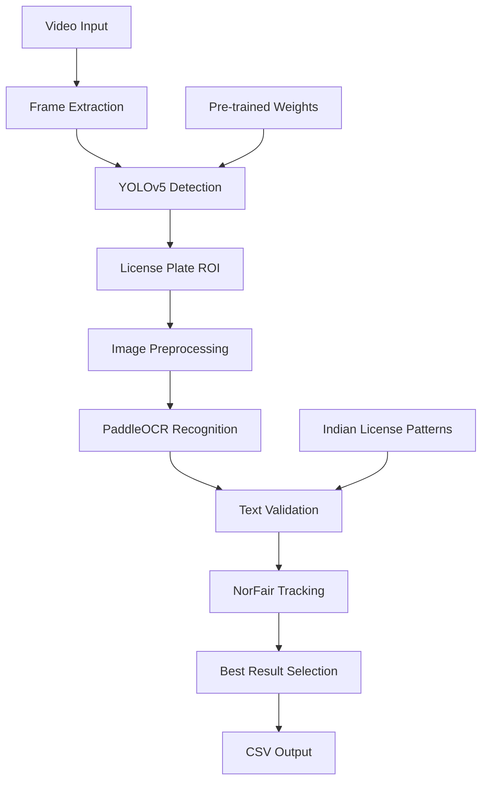

# 🚗 ANPR System - Automatic Number Plate Recognition

<div align="center">
  
  <h4>Advanced License Plate Detection & Recognition System using Deep Learning</h4>
  <p>Real-time vehicle license plate detection and OCR using YOLOv5 + PaddleOCR + NorFair tracking</p>
</div>


[](https://github.com/Tkvmaster/ANPR-System/issues)

## 🎯 Overview

This ANPR (Automatic Number Plate Recognition) system provides real-time license plate detection and character recognition using a two-stage deep learning pipeline:

1. **Detection**: YOLOv5 model detects license plates in video frames
2. **Recognition**: PaddleOCR extracts text from detected plates
3. **Tracking**: NorFair tracker ensures consistent results across frames
4. **Validation**: Regex filtering for Indian license plate formats

Perfect for traffic monitoring, parking systems, toll collection, and security applications.

## 🏗️ System Architecture



## 🚀 Quick Start

### One-Click Installation
```bash
# Clone the repository
git clone https://github.com/Tkvmaster/ANPR-System.git
cd ANPR-System

# Run the automated installer
chmod +x install.sh
./install.sh

# Activate the environment
source anpr_env/bin/activate  # or ./activate_anpr.sh

# Test the installation
anpr --help
```

### Manual Installation
```bash
# 1. Clone repository
git clone https://github.com/Tkvmaster/ANPR-System.git
cd ANPR-System

# 2. Create virtual environment
python3 -m venv anpr_env
source anpr_env/bin/activate  # Windows: anpr_env\Scripts\activate

# 3. Install dependencies
pip install -r requirements.txt  # or requirements-macos.txt/requirements-linux.txt

# 4. Clone YOLOv5 (required dependency)
git clone https://github.com/ultralytics/yolov5.git

# 5. Apply PyTorch security fixes (CRITICAL)
cd yolov5
git apply ../yolov5_pytorch_security_fix.patch
cd ..

# 6. Install ANPR package
pip install -e .
```

## 🎮 Usage

### Command Line Interface
```bash
# Basic video processing
anpr --input video.mp4 --output result.mp4 --csv plates.csv

# With custom parameters
anpr --input video.mp4 \
     --output result.mp4 \
     --csv plates.csv \
     --weights runs/train/exp/weights/best.pt \
     --frame-skip 5 \
     --min-conf 0.5

# Process image
anpr --input image.jpg --output result.jpg --csv plates.csv
```

### Web Interface
```bash
# Launch Streamlit web app
anpr-web

# Or manually
streamlit run anpr_system/web_app.py
```

### Python API
```python
from anpr_system import ANPRSystem

# Initialize system
anpr = ANPRSystem(weights_path="runs/train/exp/weights/best.pt")

# Process video
results = anpr.process_video(
    input_path="input.mp4",
    output_path="output.mp4",
    csv_path="results.csv",
    frame_skip=5,
    min_confidence=0.5
)
```

## 📊 Performance

| Metric | Value |
|--------|-------|
| **Detection Speed** | ~30-60 FPS (with frame skipping) |
| **Accuracy** | 85-95% (depends on video quality) |
| **Supported Formats** | MP4, AVI, MOV, JPG, PNG |
| **Platform Support** | macOS, Linux, Windows |
| **GPU Acceleration** | CUDA (Linux), MPS (Apple Silicon) |

## 🎛️ Parameters

| Parameter | Description | Default | Range |
|-----------|-------------|---------|-------|
| `--input` | Input video/image path | Required | - |
| `--output` | Output video/image path | `output.mp4` | - |
| `--csv` | CSV output path | `results.csv` | - |
| `--weights` | YOLOv5 model weights | `runs/train/exp/weights/best.pt` | - |
| `--frame-skip` | Process every Nth frame | `5` | 1-10 |
| `--min-conf` | Minimum detection confidence | `0.5` | 0.1-1.0 |
| `--device` | Processing device | `auto` | `cpu`, `cuda`, `mps` |

## 🏷️ License Plate Formats

The system validates Indian license plate formats:

### Standard Format
- **Pattern**: `[A-Z]{2}[0-9]{1,2}[A-Z]{1,2}[0-9]{1,4}`
- **Examples**: `UP16BT5797`, `DL1ZA9759`, `MH02AB1234`

### BH Series (Bharat Series)
- **Pattern**: `[0-9]{2}BH[0-9]{4}[A-Z]{1,2}`
- **Examples**: `22BH1234AB`, `23BH5678XY`

### State Codes
- **Delhi**: `DL` (1-2 digit RTO)
- **Maharashtra**: `MH` (2 digit RTO)
- **Uttar Pradesh**: `UP` (2 digit RTO)
- **And more...**

## 📁 Project Structure

```
ANPR-System/
├── anpr_system/              # Main Python package
│   ├── __init__.py
│   ├── core.py              # Core ANPR logic
│   ├── cli.py               # Command-line interface
│   ├── web_app.py           # Streamlit web app
│   └── utils.py             # Utility functions
├── install.sh               # One-click installer
├── setup.py                 # Package metadata
├── pyproject.toml           # Modern Python packaging
├── requirements.txt         # Dependencies
├── requirements-macos.txt   # macOS-specific dependencies
├── requirements-linux.txt   # Linux-specific dependencies
├── deploy.sh                # Deployment package generator
├── runs/train/exp/          # Pre-trained model weights
│   └── weights/
│       ├── best.pt
│       └── last.pt
├── utility_files/           # Assets and images
├── notebooks/               # Jupyter notebooks (development)
├── legacy/                  # Original script (reference)
├── test_data/               # Sample test videos
├── results/                 # Output directory
├── yolov5/                  # YOLOv5 framework (install separately)
├── yolov5_pytorch_security_fix.patch  # Critical security fixes
├── Dockerfile               # Container configuration
├── docker-compose.yml       # Multi-container setup
├── README.md                # This file
├── QUICK_START.md           # Quick start guide
├── DEPLOYMENT.md            # Deployment guide
└── .gitignore               # Git ignore rules
```

## 🐳 Docker Deployment

### Using Docker Compose
```bash
# Start web application
docker-compose up web

# Start CLI processing
docker-compose run cli anpr --input video.mp4 --output result.mp4
```

### Manual Docker
```bash
# Build image
docker build -t anpr-system .

# Run web app
docker run -p 8501:8501 anpr-system anpr-web

# Run CLI
docker run -v $(pwd):/data anpr-system anpr --input /data/video.mp4 --output /data/result.mp4
```

## 🔧 Troubleshooting

### Common Issues

**1. YOLOv5 Import Error**
```bash
# Ensure YOLOv5 is cloned and patched
git clone https://github.com/ultralytics/yolov5.git
cd yolov5 && git apply ../yolov5_pytorch_security_fix.patch
```

**2. PyTorch Security Warnings**
```bash
# Apply the security patch
cd yolov5
git apply ../yolov5_pytorch_security_fix.patch
```

**3. PaddleOCR Installation Issues**
```bash
# macOS (CPU-only)
pip install paddlepaddle paddleocr

# Linux (with GPU)
pip install paddlepaddle-gpu paddleocr
```

**4. OpenCV Conflicts**
```bash
# Remove conflicting packages
pip uninstall opencv-python opencv-contrib-python
pip install opencv-python-headless
```

### Platform-Specific Setup

**macOS (Apple Silicon)**
```bash
# Use CPU-only requirements
pip install -r package-config/requirements-macos.txt
```

**Linux (with CUDA)**
```bash
# Use GPU-enabled requirements
pip install -r package-config/requirements-linux.txt
```

## 📈 Performance Optimization

### Speed Improvements
- **Frame Skipping**: Process every 5th frame (`--frame-skip 5`)
- **GPU Acceleration**: Use CUDA (Linux) or MPS (Apple Silicon)
- **Confidence Filtering**: Increase `--min-conf` to reduce false positives

### Accuracy Improvements
- **Better Lighting**: Ensure good video quality
- **Stable Camera**: Minimize camera shake
- **Proper Angle**: License plates should be clearly visible

## 🤝 Contributing

1. Fork the repository
2. Create a feature branch (`git checkout -b feature/amazing-feature`)
3. Commit your changes (`git commit -m 'Add amazing feature'`)
4. Push to the branch (`git push origin feature/amazing-feature`)
5. Open a Pull Request

## 📄 License

This project is licensed under the MIT License - see the [LICENSE](LICENSE) file for details.

## 🙏 Acknowledgments

- [YOLOv5](https://github.com/ultralytics/yolov5) - Object detection
- [PaddleOCR](https://github.com/PaddlePaddle/PaddleOCR) - Text recognition
- [NorFair](https://github.com/tryolabs/norfair) - Object tracking
- [OpenCV](https://opencv.org/) - Computer vision
- [PyTorch](https://pytorch.org/) - Deep learning framework

## 📞 Support

- **Issues**: [GitHub Issues](https://github.com/Tkvmaster/ANPR-System/issues)
- **Discussions**: [GitHub Discussions](https://github.com/Tkvmaster/ANPR-System/discussions)
- **Email**: [Contact via LinkedIn](https://www.linkedin.com/in/tkvmaster/)

---

<div align="center">
  <p>Made with ❤️ for the computer vision community</p>
  <p>⭐ Star this repo if you found it helpful!</p>
</div>